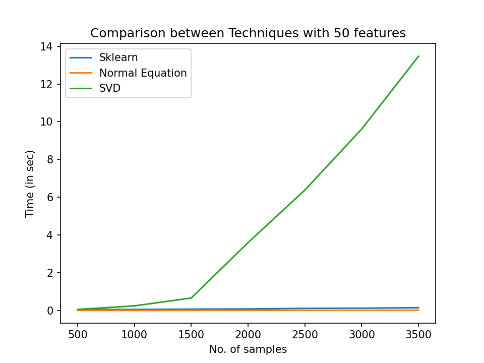
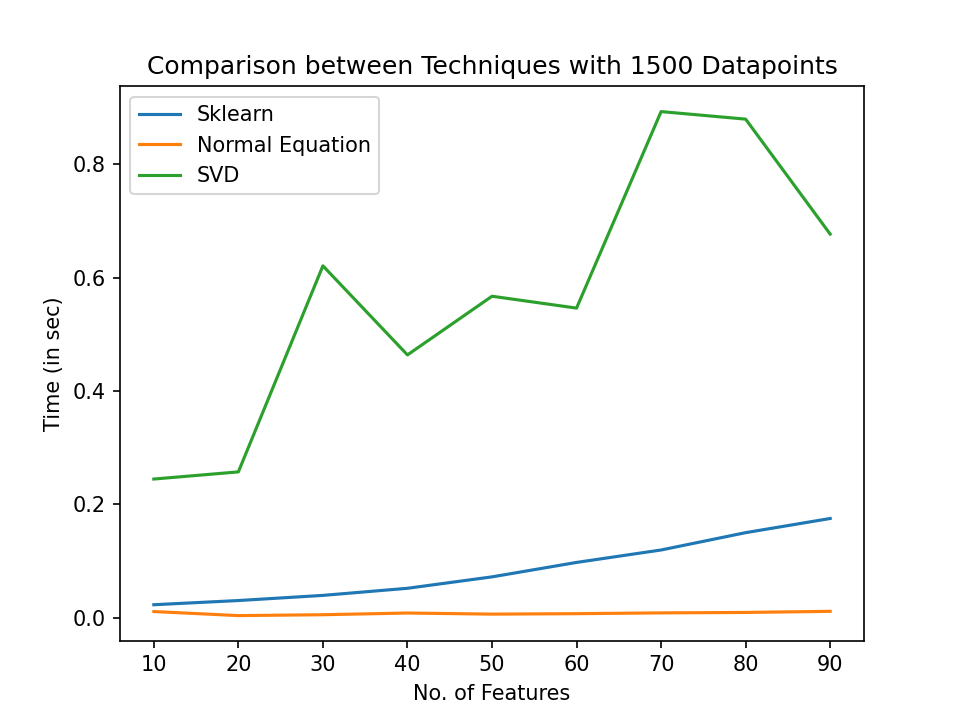

# Answer 1

For sklearn LinearRegression : 

RMSE:  0.6207498618060853 |
MAE:  0.5126346094502968
---------------------------
For linear regression using normal equations : 

RMSE:  0.6207498618060853 | 
MAE:  0.5126346094502968
---------------------------
For linear regression using SVD : 

RMSE:  0.6207498618060853 |
MAE:  0.5126346094502968
---------------------------

|Description|Images|
|----|-------------|
|Time vs No. of Samples with 50 features||
|Time vs Features with 1500 Datapoints||