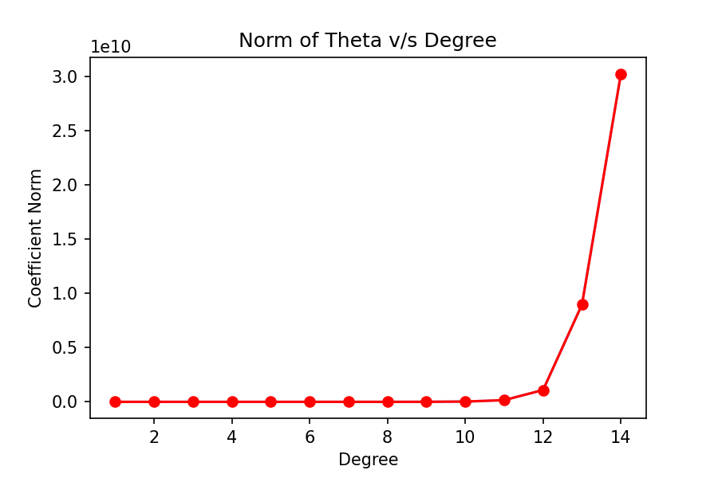
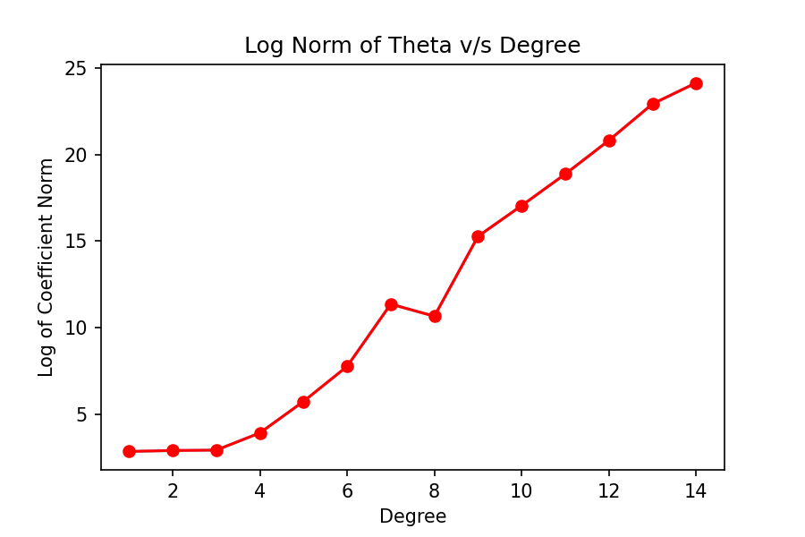

# Answer 4

When using polynomial features in linear regression, the coefficient magnitude can increase as the degree of the polynomial features increases. This is because higher degree polynomial features introduce more complex relationships between the input features and the output variable, which may require larger coefficients to accurately model the data.

The relationship between the polynomial features used in linear regression and the Taylor series can help explain why the coefficients of the polynomial features increase rapidly after a certain degree. In the Taylor series expansion of a function, the coefficients of the polynomial terms are determined by the derivatives of the function evaluated at a particular point. As the degree of the polynomial terms increases, the derivatives of the function become larger and more complex, leading to larger coefficients.

|Description|Images|
|----|-------------|
|Norm of Theta v/s Degree||
|Log Norm of Theta v/s Degree||