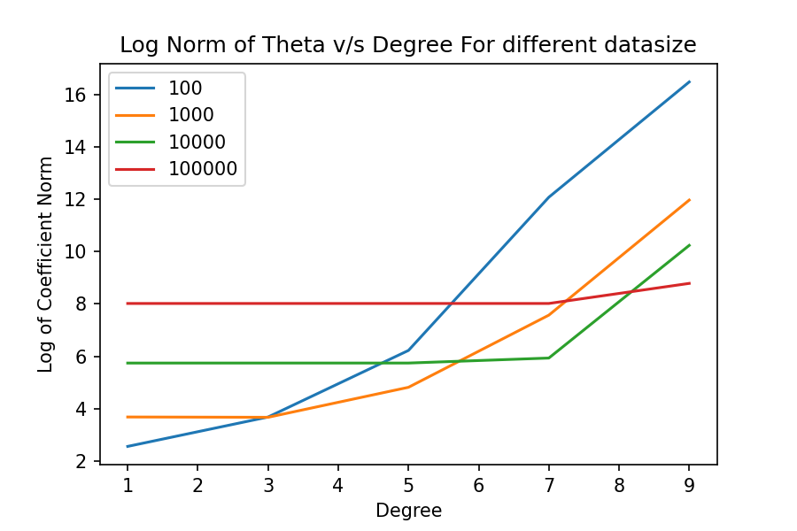

# Answer 5

For a given degree of polynomial, the norm of theta generally tends to increase as the size of the dataset increases. This is because a larger dataset provides more information about the relationship between the input features and the output variable, allowing the model to fit the data more accurately. As a result, the coefficients of the model may become more complex and have larger absolute values, leading to a higher norm of theta.

However, the relationship between the size of the dataset and the norm of theta may not be linear. In particular, for smaller dataset sizes, the norm of theta may increase rapidly as the degree of the polynomial increases, indicating overfitting. On the other hand, for larger dataset sizes, the increase in the norm of theta may level off or even decrease as the degree of the polynomial increases, as the model becomes better able to generalize to new data.

Therefore, while the size of the dataset can affect the norm of the parameters of a model, the relationship between the two is not straightforward and depends on various factors such as the complexity of the model, the degree of overfitting, and the underlying relationships between the input features and output variable.

|Description|Images|
|----|-------------|
|Log Norm of Theta v/s Degree For different datasize||
