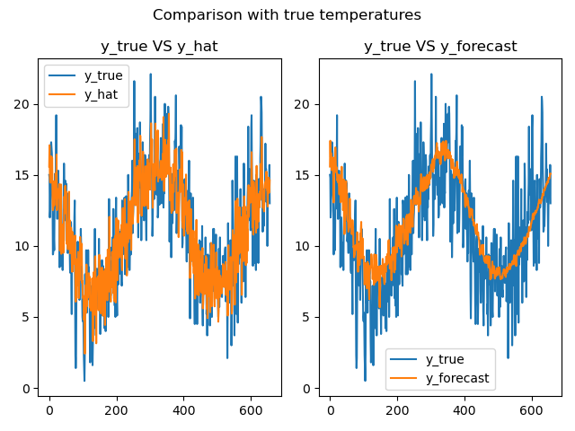

# Answer 7

For Minimum Daily Temperatures dataset from Australia on Test Set: 

RMSE:  2.283184885410409
MAE:  1.792380932066246
---------------------------
For Minimum Daily Temperatures dataset from Australia Forecasting: 

RMSE:  2.743394217942705
MAE:  2.125815778456995
---------------------------

|Description|Images|
|----|-------------|
|y_true VS y_hat and y_true VS y_forecast||
